Popularność imion w USA
================

W tej analizie chcę pokazać trzy rzeczy:

1.  Jak dużo można wycisnąć z prostych danych.
2.  Że dzięki błędom można dowiedzieć się czegoś ważnego.
3.  W jak różny sposób można przedstawić podobne dane.

## Dane

Będę korzystał z danych `babynames` dostępnych w pakiecie o tej samej
nazwie, w których podano liczbę nadawanych dzieciom imion w USA, od 1880
do 2017 roku. Poniżej pierwsze dziesięć wierszy.

``` r
library("tidyverse")
library("babynames")
theme_set(theme_classic())

babynames
```

    ## # A tibble: 1,924,665 x 5
    ##     year sex   name          n   prop
    ##    <dbl> <chr> <chr>     <int>  <dbl>
    ##  1  1880 F     Mary       7065 0.0724
    ##  2  1880 F     Anna       2604 0.0267
    ##  3  1880 F     Emma       2003 0.0205
    ##  4  1880 F     Elizabeth  1939 0.0199
    ##  5  1880 F     Minnie     1746 0.0179
    ##  6  1880 F     Margaret   1578 0.0162
    ##  7  1880 F     Ida        1472 0.0151
    ##  8  1880 F     Alice      1414 0.0145
    ##  9  1880 F     Bertha     1320 0.0135
    ## 10  1880 F     Sarah      1288 0.0132
    ## # ... with 1,924,655 more rows

Dane są bardzo proste, w zasadzie mamy w nich jedynie informację o
częstościach imion, natomiast opowiadają bardzo ciekawe historie i kilka
z nich spróbujemy odkryć.

## Popularność

Które imiona były nadawane najczęściej dla wszystkich dostępnych lat?
Pamiętam, że gdy pierwszy raz chciałem odpowiedzieć na to pytanie, bez
zastanowienia wywołałem funkcję `count()` na kolumnie `name`. Zwykle
jest to dobry pomysł – otrzymam, jak często dane imię występuje w bazie
i sortując wyniki malejąco, zobaczę najpopularniejsze:

``` r
count(babynames, name, sort = TRUE)
```

    ## # A tibble: 97,310 x 2
    ##    name        n
    ##    <chr>   <int>
    ##  1 Francis   276
    ##  2 James     276
    ##  3 Jean      276
    ##  4 Jesse     276
    ##  5 Jessie    276
    ##  6 John      276
    ##  7 Johnnie   276
    ##  8 Joseph    276
    ##  9 Lee       276
    ## 10 Leslie    276
    ## # ... with 97,300 more rows

Tylko że dane już są zagregowane rocznie, także żeby dostać prawidłowy
wynik, muszę uwzględnić kolumnę `n` (mam na myśli tę w pierwotnych
danych, bo akurat wyżej też mamy kolumnę `n`, funkcja `count()` ją
tworzy). Na szczęście wystarczy, że ustawię parametr `wt` – policzę
*sumę ważoną*.

``` r
count(babynames, name, wt = n, sort = TRUE)
```

    ## # A tibble: 97,310 x 2
    ##    name          n
    ##    <chr>     <int>
    ##  1 James   5173828
    ##  2 John    5137142
    ##  3 Robert  4834915
    ##  4 Michael 4372536
    ##  5 Mary    4138360
    ##  6 William 4118553
    ##  7 David   3624225
    ##  8 Joseph  2614083
    ##  9 Richard 2572613
    ## 10 Charles 2398453
    ## # ... with 97,300 more rows

Wynik wyglądają już sensownie. W tym momencie można by zignorować te
poprzednie liczby, polecam jednak zawsze zastanawiać się, czy to, co
dostajemy, ma sens. Bo ok, źle to policzyliśmy, ale czy da się wyjaśnić,
co daje 138 lat – czy w takim razie John nie powinien występować 138
razy?

Po pierwsze, zauważmy, że 276 to dokładnie dwa razy więcej – to pewnie
nie jest przypadek. Po drugie, w danych oprócz informacji o imieniu,
jest też kolumna z płcią. Może w każdym roku mamy i mężczyzn, i kobiety
o imieniu John? Hmm, co prawa są imiona, które pasują do obu płci, ale
John? Może w kolumnie `n` dla “kobiet Johnów” występuje 0? Zamiast
zastanawiać się zbyt długo, po prostu sprawdźmy.

``` r
filter(babynames, name == "John")
```

    ## # A tibble: 276 x 5
    ##     year sex   name      n     prop
    ##    <dbl> <chr> <chr> <int>    <dbl>
    ##  1  1880 F     John     46 0.000471
    ##  2  1880 M     John   9655 0.0815  
    ##  3  1881 F     John     26 0.000263
    ##  4  1881 M     John   8769 0.0810  
    ##  5  1882 F     John     40 0.000346
    ##  6  1882 M     John   9557 0.0783  
    ##  7  1883 F     John     40 0.000333
    ##  8  1883 M     John   8894 0.0791  
    ##  9  1884 F     John     40 0.000291
    ## 10  1884 M     John   9388 0.0765  
    ## # ... with 266 more rows

``` r
filter(babynames, name == "John") %>% slice_tail(n = 10)
```

    ## # A tibble: 10 x 5
    ##     year sex   name      n       prop
    ##    <dbl> <chr> <chr> <int>      <dbl>
    ##  1  2013 F     John     16 0.00000832
    ##  2  2013 M     John  10704 0.00531   
    ##  3  2014 F     John     14 0.00000717
    ##  4  2014 M     John  10687 0.00523   
    ##  5  2015 F     John     11 0.00000565
    ##  6  2015 M     John  10373 0.00509   
    ##  7  2016 F     John     12 0.00000622
    ##  8  2016 M     John   9995 0.00495   
    ##  9  2017 F     John     10 0.00000533
    ## 10  2017 M     John   9434 0.00481

Wygląda na to, że jednak mamy w danych kobiety o takim imieniu, i to
zarówno w XIX, jak i w XXI wieku. Powodów może być wiele. Powiedzmy, że
na wszelki wypadek lepiej takich przypadków nie uwzględniać (może to
błędy?). Najprostsze rozwiązanie, jakie przyszło mi do głowy, to dodanie
zmiennej `sex` do `count()`. Wtedy zliczę imiona oddzielnie dla kobiet i
mężczyzn, dzięki czemu te “dziwne” przypadki będą nisko w rankingu.

``` r
count(babynames, sex, name, wt = n, sort = TRUE)
```

    ## # A tibble: 107,973 x 3
    ##    sex   name          n
    ##    <chr> <chr>     <int>
    ##  1 M     James   5150472
    ##  2 M     John    5115466
    ##  3 M     Robert  4814815
    ##  4 M     Michael 4350824
    ##  5 F     Mary    4123200
    ##  6 M     William 4102604
    ##  7 M     David   3611329
    ##  8 M     Joseph  2603445
    ##  9 M     Richard 2563082
    ## 10 M     Charles 2386048
    ## # ... with 107,963 more rows

## Różnorodność

W wynikach może nas zdziwić tylko jedno kobiece imię w pierwszej
dziesiątce, przecież całkowita liczba kobiet i mężczyzn powinna być
podobna. Zobaczmy pierwszą trzydziestkę, np. na wykresie słupkowym
kolorowanym ze względu na płeć. Dzielę `n` przez milion, żeby etykiety
były bardziej czytelne.

``` r
baby_count <- babynames %>% 
  count(sex, name, wt = n, sort = TRUE)

baby_count %>% 
  slice(1:30) %>% 
  mutate(n = n / 1e6) %>% 
  mutate(name = fct_reorder(name, n)) %>% 
  ggplot(aes(name, n, fill = sex)) +
    geom_col() +
    coord_flip() +
    labs(y = "n [mln]")
```

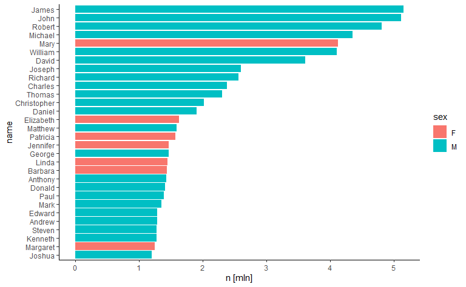

Pojawiło się więcej żeńskich imion, choć wciąż mało. Ale może są one
bardziej różnorodne? Policzmy, jak dużo męskich i żeńskich imion
występuje w każdym roku i nanieśmy wyniki na wykres liniowy.

``` r
babynames %>% 
  count(year, sex) %>% 
  ggplot(aes(year, n, col = sex)) +
    geom_line(size = 1.2)
```

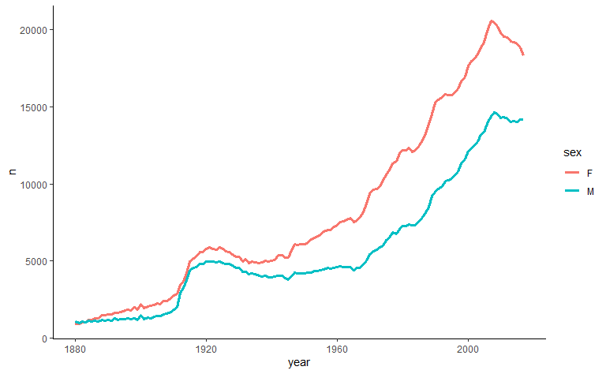

Zgadza się, imion żeńskich jest więcej. Może jednak warto przedstawić
ten wykres trochę inaczej. Widać, że z roku na rok rodziło się coraz
więcej dzieci – chciałbym zbadać różnorodność imion, biorąc poprawkę na
ten fakt. Po drugie, w niektórych latach mogło urodzić się mniej
mężczyzn niż kobiet lub odwrotnie – i to też dobrze byłoby uwzględnić.
Proponuję w takim razie policzyć liczbę różnych imion kobiecych na 1000
urodzonych kobiet oraz liczbę różnych imion męskich na 1000 urodzonych
mężczyzn.

``` r
babynames %>% 
  group_by(year, sex) %>%
  summarise(names = n(), births = sum(n)) %>% 
  mutate(ratio = names / births * 1000) %>% 
  ggplot(aes(year, ratio, col = sex)) +
    geom_line(size = 1.2) +
    labs(y = "names per 1000 births")
```

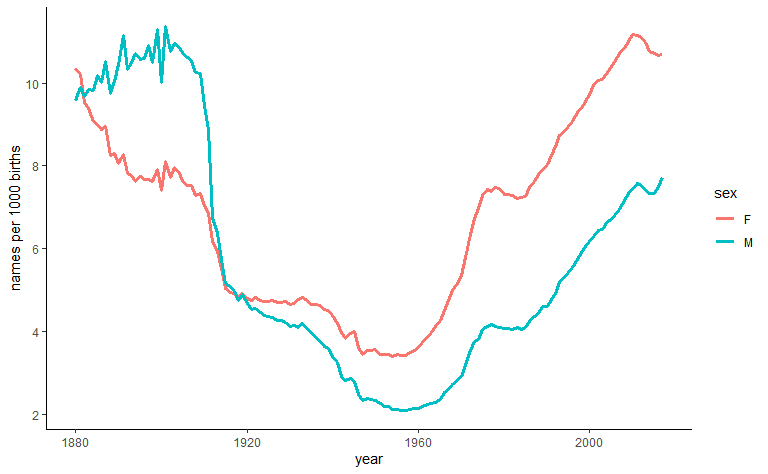

Wykres jest interesujący. Po pierwsze, patrząc na problem w ten sposób,
pod koniec XIX wieku różnorodność imion była podobna jak obecnie: na
każde 1000 urodzeń przypadało 8-10 imion. Co może jeszcze ciekawsze, na
przełomie XIX i XX wieku to męskie imiona cechowała większa
różnorodność.

Pytanie tylko, czemu nie było tego widać na poprzednim wykresie? Tzn.
poza kilkoma początkowymi latami, liczba kobiecych imion była stale
większa od męskich. Skoro tak, to na przełomie XIX i XX wieku musiało
rodzić się znacząco więcej kobiet od mężczyzn. Sprawdźmy to. Poniżej
liczba urodzeń w poszczególnych latach oddzielnie dla kobiet i mężczyzn.

``` r
babynames %>% 
  count(year, sex, wt = n) %>% 
  ggplot(aes(year, n / 1e6, col = sex)) +
    geom_line(size = 1.2) +
    labs(y = "n [mln]")
```

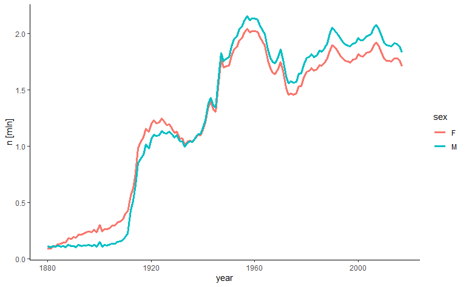

Rzeczywiście, przez długi czas rodziło się więcej kobiet. Na pierwszych
rzut oka w późniejszych latach tendencja się odwróciła, ale jej
natężenie jest podobne. Trzeba jednak uwzględnić, że w pierwszych latach
ogólnie jest znacznie mniej urodzeń. Znów spójrzmy na sprawę relatywnie:
podzielmy liczbę urodzeń kobiet przez liczbę urodzeń mężczyzn. Pozioma
lina to jednakowa liczba urodzeń.

``` r
babynames %>% 
  count(year, sex, wt = n) %>% 
  pivot_wider(names_from = sex, values_from = n) %>%
  mutate(ratio = F / M) %>% 
  ggplot(aes(year, ratio)) +
    geom_line(size = 1.2) +
    geom_hline(yintercept = 1) +
    labs(y = "women to men ratio")
```

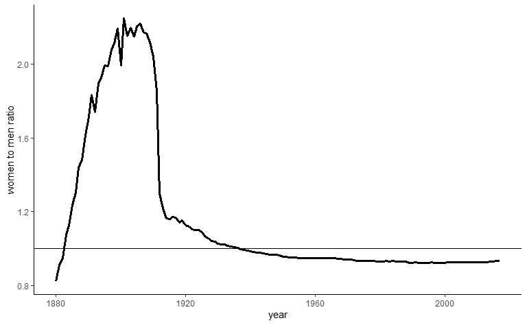

Na przełomie XIX i XX wieku w USA rodziło się ponad dwa razy więcej
kobiet! Jest to dla mnie co najmniej dziwne i zupełnie nie wiem, z czego
może wynikać. Czy rzeczywiście tak było, czy może z jakiegoś powodu
brakuje danych o męskich urodzeniach w tym czasie? Może dane zbierano po
I wojnie światowej i ponieważ część amerykańskich mężczyzn zginęła,
utrudniło to dostęp do ich danych? Szczerze mówiąc, ani trochę mnie to
nie przekonuje. Ktoś mądrzejszy w tym temacie musiałby na to spojrzeć.

Dodam, że wcale nie uważam, że takie patrzenie na problem różnorodności
imion (ich liczba na tysiąc urodzeń) jest optymalne. To nie jest łatwa
decyzja, jaki wskaźnik przyjąć. Natomiast widać, jak dużo od wyboru tego
wskaźnika zależy.

## Popularność w różnych latach

Jak do tej pory znaleźliśmy imiona, które były w sumie najczęściej
nadawane w USA. Spójrzmy na sprawę inaczej: które imiona przez większość
czasu były najpopularniejsze? Albo które utrzymywały się w czołówce?
Poniżej tworzę trzy miary, które mają mi pomóc w odpowiedzi na te
pytania – każda z nich pozwoli inaczej podejść do problemu.

-   `n_rank` to zwykłe rangowanie: najpopularniejsze imię otrzymuje
    rangę 1, kolejne 2, a ostatnie nie wiadomo – zależy, ile było imion
    w danym roku. W funkcji `rank()` pomnożyłem `n` przez -1, bo chcę,
    żeby kolejność była właśnie taka, jak podałem wyżej (domyślnie
    najmniejsza wartość otrzymuje rangę 1).

-   Problem z `n_rank` jest taki, że ranga 10 w roku, w którym
    wszystkich imion było 100, różni się od rangi 10, gdy tych imion
    było 1000 (trudniej być na szczycie, gdy mamy więcej rywali).
    Dlatego dorzuciłem informację, w którym percentylu jest każde imię
    (`n_percentile`). Pierwszy percentyl to 1% najpopularniejszych
    imion.

-   Jeśli imion jest dużo, dla powyższej miary nie ma różnicy, czy imię
    jest np. na pierwszym czy drugim miejscu. Mógłbym pójść w kierunku
    dokładniejszych kwantyli, ale zamiast tego skaluję rangowanie do
    przedziału \[0, 1\]. Żeby liczby były “przyjemniejsze”, skaluję to
    jeszcze do \[1, 100\]. Tym sposobem dostaję jakby rangi, ale
    ostatnia to zawsze 100 oraz można mieć rangi ułamkowe.

``` r
babynames <- babynames %>% 
  group_by(year, sex) %>% 
  mutate(
    n_rank = rank(-n),
    n_percentile = ntile(-n, 100),
    n_rank_perc = 99 * percent_rank(-n) + 1
  ) %>% 
  ungroup()
```

Zobaczmy, które imiona najczęściej były na pierwszym miejscu (przez ile
lat). Poniżej top 5 dla kobiet i mężczyzn. (Ponieważ wielokrotnie będę
używał grupowania ze względu na płeć i imię, włączam je “na stałe”).

``` r
babynames <- babynames %>% group_by(sex, name)

babynames %>% 
  summarise(rank_first = sum(n_rank == 1)) %>% 
  slice_max(rank_first, n = 5)
```

    ## # A tibble: 10 x 3
    ## # Groups:   sex [2]
    ##    sex   name     rank_first
    ##    <chr> <chr>         <int>
    ##  1 F     Mary             76
    ##  2 F     Jennifer         15
    ##  3 F     Emily            12
    ##  4 F     Jessica           9
    ##  5 F     Lisa              8
    ##  6 M     John             44
    ##  7 M     Michael          44
    ##  8 M     Robert           17
    ##  9 M     Jacob            14
    ## 10 M     James            13

Co ciekawe, porównując z poprzednimi wynikami, mimo że James to
najczęściej nadawane imię, było na pierwszym miejscu tylko przez 13 lat,
a John i Michael przez 44. Mary aż 76 lat, czyli przez ponad połowę
badanego okresu.

Może jednak zluzujmy trochę kryteria: policzmy, przez ile lat dane imię
było w pierwszej trójce.

``` r
babynames %>% 
  summarise(rank_first = sum(n_rank <= 3)) %>% 
  slice_max(rank_first, n = 5)
```

    ## # A tibble: 10 x 3
    ## # Groups:   sex [2]
    ##    sex   name    rank_first
    ##    <chr> <chr>        <int>
    ##  1 F     Mary            87
    ##  2 F     Helen           30
    ##  3 F     Anna            25
    ##  4 F     Emma            22
    ##  5 F     Dorothy         20
    ##  6 M     James           81
    ##  7 M     John            79
    ##  8 M     Michael         58
    ##  9 M     William         49
    ## 10 M     Robert          36

Już ranking wygląda inaczej. Mógłbym oczywiście iść dalej w tym
kierunku, rozważając imiona w pierwszej piątce, dziesiątce itd. Zamiast
tego zmieńmy sposób podsumowania: uporządkujmy imiona według średniej
rangi.

``` r
babynames %>% 
  summarise(rank_mean = mean(n_rank)) %>% 
  slice_min(rank_mean, n = 5)
```

    ## # A tibble: 10 x 3
    ## # Groups:   sex [2]
    ##    sex   name      rank_mean
    ##    <chr> <chr>         <dbl>
    ##  1 F     Elizabeth     12.1 
    ##  2 F     Mary          19.5 
    ##  3 F     Anna          40.7 
    ##  4 F     Sarah         45.0 
    ##  5 F     Margaret      50.5 
    ##  6 M     James          5.45
    ##  7 M     William        6.36
    ##  8 M     John           6.37
    ##  9 M     Joseph        10.3 
    ## 10 M     Robert        11.9

Ciekawa sytuacja, na pierwszym miejscu jest Elizabeth. Widocznie były
lata, w których Mary nie była zbyt popularna. Pamiętajmy jednak o tym
problemie, o którym wspomniałem: że dana ranga w różnych latach nie jest
do końca porównywalna. Zastosujmy w takim razie miarę percentylową.

``` r
babynames %>% 
  summarise(rank_mean = mean(n_percentile)) %>% 
  slice_min(rank_mean, n = 5)
```

    ## # A tibble: 11 x 3
    ## # Groups:   sex [2]
    ##    sex   name      rank_mean
    ##    <chr> <chr>         <dbl>
    ##  1 F     Elizabeth      1   
    ##  2 F     Margaret       1   
    ##  3 F     Mary           1   
    ##  4 F     Anna           1.22
    ##  5 F     Catherine      1.41
    ##  6 M     Charles        1   
    ##  7 M     James          1   
    ##  8 M     John           1   
    ##  9 M     Joseph         1   
    ## 10 M     Thomas         1   
    ## 11 M     William        1

Imiona z czołówki albo przez wszystkie, albo prawie wszystkie lata były
w pierwszym percentylu. Zmieńmy miarę na dokładniejszą.

``` r
babynames %>% 
  summarise(rank_mean = mean(n_rank_perc)) %>% 
  slice_min(rank_mean, n = 5)
```

    ## # A tibble: 10 x 3
    ## # Groups:   sex [2]
    ##    sex   name      rank_mean
    ##    <chr> <chr>         <dbl>
    ##  1 F     Mary           1.11
    ##  2 F     Elizabeth      1.19
    ##  3 F     Margaret       1.42
    ##  4 F     Anna           1.51
    ##  5 F     Sarah          1.93
    ##  6 M     John           1.06
    ##  7 M     James          1.08
    ##  8 M     William        1.09
    ##  9 M     Robert         1.21
    ## 10 M     Joseph         1.24

Przypadek Mary, która nie wygrała w jednym z poprzednich rankingów,
zainspirował mnie do tego, żeby znaleźć imiona, dla których różnica w
rankingach w różnych latach była największa. Czyli były lata, w których
imię było bardzo popularne, ale też takie, w których nadawano je rzadko.
Chyba najlepiej użyć do tego `n_rank_perc`.

``` r
diff <- babynames %>% 
  summarise(
    rank_max = max(n_rank_perc),
    rank_min = min(n_rank_perc),
    rank_diff = rank_max - rank_min
  ) %>% 
  slice_max(rank_diff, n = 5)
diff
```

    ## # A tibble: 10 x 5
    ## # Groups:   sex [2]
    ##    sex   name      rank_max rank_min rank_diff
    ##    <chr> <chr>        <dbl>    <dbl>     <dbl>
    ##  1 F     Natalie       88.8     1.06      87.8
    ##  2 F     Judith        88.8     1.06      87.8
    ##  3 F     Penelope      88.8     1.12      87.7
    ##  4 F     Judy          88.8     1.17      87.7
    ##  5 F     Amber         88.6     1.09      87.5
    ##  6 M     Sebastian     88.8     1.15      87.6
    ##  7 M     Greyson       89.1     1.55      87.6
    ##  8 M     Cody          88.8     1.22      87.6
    ##  9 M     Hudson        88.8     1.42      87.4
    ## 10 M     Asher         88.7     1.41      87.3

Pytanie, na ile Judith i Judy traktować jako różne imiona. Pewnie w
przypadku innych imion też takie sytuacje występują i być może należało
na początku analizy takie alternatywne wersje imion dodać. Ja w dalszej
część zdecydowałem się zrezygnować z “Judy”.

Zobaczmy, jak dokładnie wyglądała zmiana w popularności tych imion.
Chciałbym przedstawić na wykresie zależność między rangą a rokiem.
Pewien problem sprawiły mi imiona, które nie są typowe dla danej płci.
Jeśli niżej po prostu filtrowałbym po wytypowanych imionach, wykres
wyglądałby źle, bo dla niektórych lat miałbym nieliczne przypadki kobiet
Sebastianów itp. Dlatego muszę filtrować po obu kolumnach, `sex` i
`name` (interesuje mnie nie jakikolwiek Sebastian, ale mężczyzna
Sebastian). Być może da się to prościej rozwiązać, ale ja połączyłem
kolumny `sex` i `name` w jedną i filtruję po niej.

``` r
diff_names <- diff %>%
  filter(name != "Judy") %>%
  unite(sex_name, sex, name) %>% 
  pull(sex_name)

babynames <- babynames %>% 
  unite(sex_name, sex, name, remove = FALSE)

babynames %>% 
  filter(sex_name %in% diff_names) %>% 
  ggplot(aes(year, n_rank_perc)) +
    geom_line(size = 1.2) +
    facet_wrap(vars(name), ncol = 3)
```

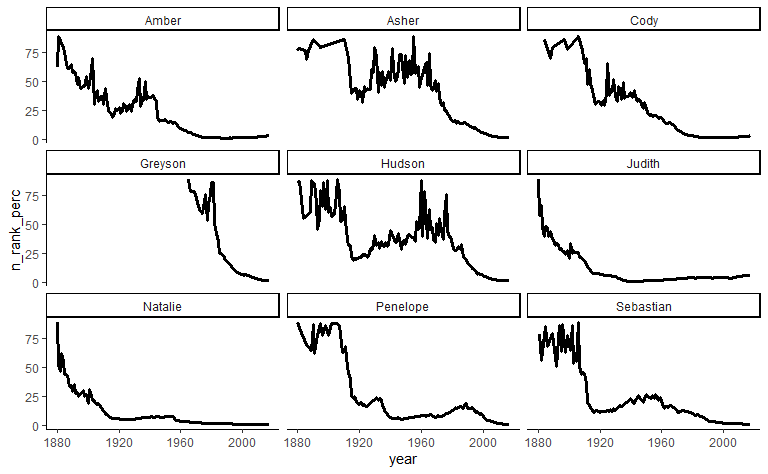

W początkowych latach, gdy imię było rzadkie, widzimy duże wahania w
rangach. A raczej nie ma znaczenia, czy ranga wynosi 61 czy 62. Z kolei
gdy rangi są niskie, chciałbym wiedzieć, czy są równe 1 czy 2. Skoro
różnice dla małych wartości są dla mnie ważniejsze, niż dla dużych,
logarytmuję oś Y.

``` r
babynames %>% 
  filter(sex_name %in% diff_names) %>% 
  group_by(year, name) %>% 
  slice_max(n) %>% 
  ggplot(aes(year, n_rank_perc)) +
    geom_line(size = 1.2) +
    facet_wrap(vars(name), ncol = 3) +
    scale_y_log10()
```

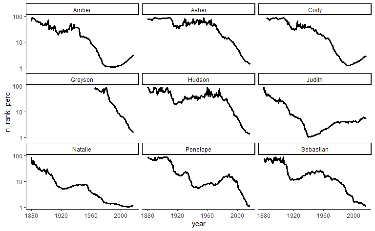

Większość z tych imion kiedyś nie była popularna, a teraz jest. Wyjątek
to Judith, która szczyt popularności miała mniej więcej w 1940 roku.

Jeśli chcielibyśmy tego typu wykresy komuś pokazać, problemem jest
miara, której używamy (oś Y) – nie jest łatwo wytłumaczyć, co prezentuje
(co gorsza, im wyższy wynik, tym rzadsze imię, co jest mało intuicyjne).
Bywa, że takie bardziej złożone miary są dobre do odkrycia pewnych
interesujących przypadków, ale potem te przypadki można już
zaprezentować, używając prostszego języka. Spójrzmy jeszcze raz na
powyższe wykresy, ale niech na osi Y będzie po prostu liczba przypadków
(ewentualnie proporcja, czyli zmienna `prop`, też byłaby dobrym
pomysłem). I tym razem logarytmowanie już chyba nie ma sensu.

``` r
babynames %>% 
  filter(sex_name %in% diff_names) %>% 
  group_by(year, name) %>% 
  slice_max(n) %>% 
  ggplot(aes(year, n)) +
    geom_line(size = 1.2) +
    facet_wrap(vars(name), ncol = 3)
```

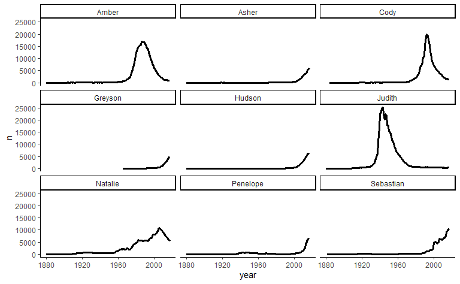

Popularność niektórych imiona (np. Greyson lub Asher) wygląda mało
spektakularnie, co wynika z tego, że obecnie różnorodność imion jest
znacznie większa i tych, które są w czołówce, niekoniecznie jest dużo
bezwzględnie. Przewagą tych innych miar, których używałem, było
uniezależnienie się od tego zjawiska. Z drugiej strony, może wcale nie
chcę się od tego uniezależniać – jak wspomniałem, wybór dobrego
wskaźnika nie jest łatwym zadaniem.

Gdy patrzyłem na te wykresy, zacząłem się zastanawiać, jak znaleźć
imiona, których popularność mocno się zmieniła, ale w drugą stronę, tzn.
odeszły w zapomnienie. Rozwiązałem to w taki sposób, że oprócz liczenia
ekstremalnych rang, zapamiętuję ich pozycje i dalej rozpatruję tylko te
przypadki, dla których pozycja maksymalnej rangi jest większa od
minimalnej.

``` r
diff <- babynames %>% 
  summarise(
    rank_max = max(n_rank_perc),
    rank_min = min(n_rank_perc),
    rank_diff = rank_max - rank_min,
    pos_max = which.max(n_rank_perc),
    pos_min = which.min(n_rank_perc)
  ) %>% 
  filter(pos_max > pos_min) %>% 
  slice_max(rank_diff, n = 5)
diff
```

    ## # A tibble: 10 x 7
    ## # Groups:   sex [2]
    ##    sex   name     rank_max rank_min rank_diff pos_max pos_min
    ##    <chr> <chr>       <dbl>    <dbl>     <dbl>   <int>   <int>
    ##  1 F     Iesha        86.4     2.00      84.4      48      23
    ##  2 F     Willie       86.4     2.07      84.3     124      40
    ##  3 F     Myrtle       86.0     2.06      84.0     122      38
    ##  4 F     Velma        86.5     2.79      83.7     133      41
    ##  5 F     Gertrude     85.2     1.65      83.6     119      37
    ##  6 M     Seymour      86.9     4.61      82.3      94      45
    ##  7 M     Dick         86.0     4.22      81.8     111      55
    ##  8 M     Carroll      86.1     4.82      81.3     138      46
    ##  9 M     Adolph       86.1     4.85      81.2     130      38
    ## 10 M     Infant       86.1     5.05      81.0      33       8

Cóż, w przypadku przynajmniej jednego z tych imion spadek popularności
nie dziwi. Poniżej wykresy prezentujące zależność z rokiem, tym razem z
pewnych względów pomijam imię Willie.

``` r
diff_names <- diff %>% 
  filter(name != "Willie") %>% 
  unite(sex_name, sex, name) %>% 
  pull(sex_name)
babynames %>% 
  filter(sex_name %in% diff_names) %>% 
  ggplot(aes(year, n_rank_perc)) +
    geom_line(size = 1.2) +
    facet_wrap(vars(name), ncol = 3) +
    scale_y_log10()
```

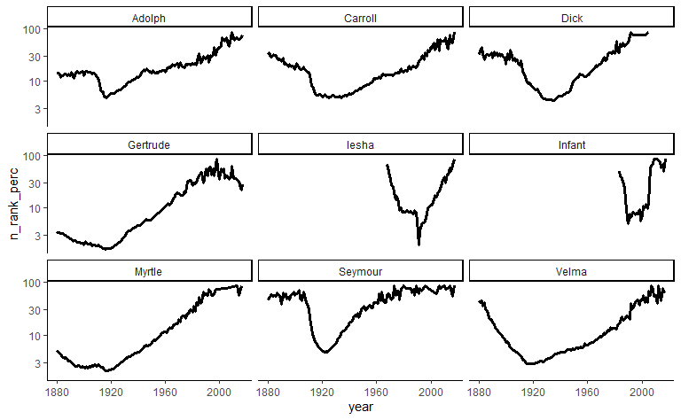

Imię Willie jest o tyle ciekawe, że było popularne zarówno wśród kobiet,
jak i mężczyzn, co widać na poniższym wykresie (na osi Y liczba
przypadków). Wśród mężczyzn wciąż jest popularne, ale jako kobiece imię
już nie.

``` r
babynames %>% 
  filter(name %in% "Willie") %>% 
  ggplot(aes(year, n_rank_perc, col = sex)) +
    geom_line(size = 1.2) +
    scale_y_log10()
```

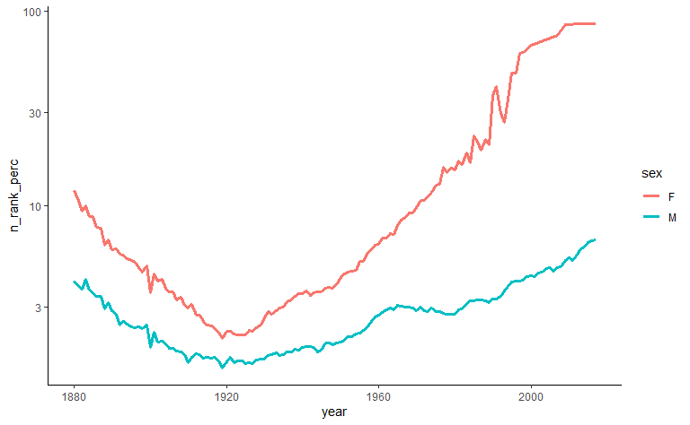

Na koniec popularność mojego imienia na tle innych. Tym razem na osi Y
proporcja. Wygenerowanie tego wykresu trochę trwa.

``` r
myname <- babynames %>%
  filter(name == "Peter", sex == "M")

babynames %>% 
  filter(sex == "M") %>% 
  ggplot(aes(year, n, group = name)) +
    geom_line(alpha = 0.1) +
    geom_line(data = myname, aes(year, n), size = 1.2, col = "red") +  
    scale_y_log10() +
    theme(panel.grid.major = element_blank(),
      panel.grid.minor = element_blank(),
      panel.background = element_blank(),
    ) 
```

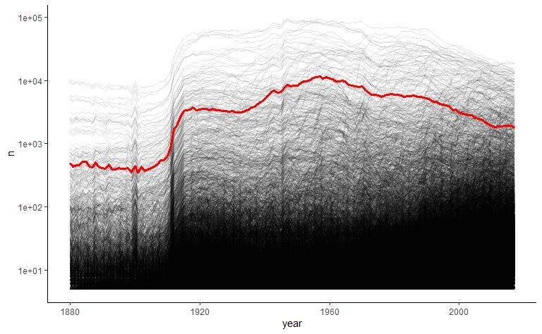
