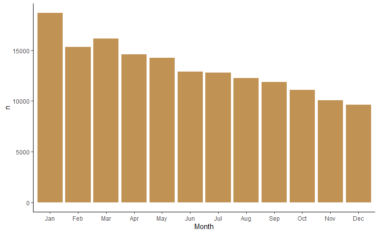
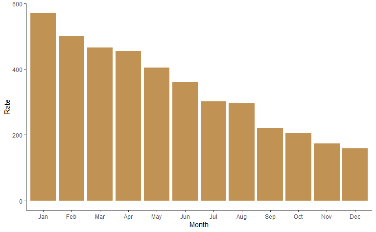

Poniższa analiza ma pokazać, jak duży wpływ na umiejętności w sporcie ma miesiąc, w którym dana osoba się urodziła. Problem jest znany, opisany choćby w książce *Superfreakonomia*, można też poczytać o nim tutaj: https://en.wikipedia.org/wiki/Relative_age_effect. W skrócie, jeśli weźmiemy dwójkę małych dzieci urodzonych w tym samym roku, ale jedno w styczniu, drugie w grudniu, to pierwsze będzie znacznie bardziej rozwinięte (to znaczy różnica jest większa, niż gdybyśmy wzięli dwójkę dorosłych). Zwykle jednak, w rozmaitych szkółkach sportowych, dzieci dzieli się zgodnie z ich rokiem urodzenia, przez co ta rozważana dwójka będzie trenować razem. Starsze dziecko, jako bardziej rozwinięte, najprawdopodobniej będzie się prezentować lepiej od młodszego. Zostanie zauważone, trafi do lepszej drużyny, co zwiększy jego szansę na rozwój. Wiele lat później, mimo że miesiąc urodzenia nie powinien już mieć znaczenia, umiejętności takiej osoby będą większe.

Przekonajmy się o tym na własne oczy, na przykładzie piłki nożnej. Przyznam, że zabierając się do tej analizy, nie spodziewałem się tak dużego efektu.

## Dane

Będę korzystał z danych zebranych z gry komputerowej Football Manager 2017 (https://www.kaggle.com/ajinkyablaze/football-manager-data), w której znajdują się informacje o prawie 160 tysiącach piłkarzy. Interesować mnie będzie tylko nazwisko zawodnika, data urodzenia, kraj pochodzenia i liczba występów międzynarodowych. W drugiej części analizy wykorzystam jeszcze dane o liczbie urodzeń we Włoszech w zależności od miesiąca i roku (http://data.un.org/Data.aspx?d=POP&f=tableCode%3A55).

Z początku miałem wątpliwości, na ile dane z gry komputerowej odpowiadają rzeczywistości (to znaczy, czy daty urodzenia są prawdziwe). Sprawdziłem dla kilku piłkarzy i zgadzały się, także założyłem, że można na nich polegać.

## Wszystkie kraje


```r
library("tidyverse")
library("lubridate")
theme_set(theme_classic())

foot <- read_csv("dataset.csv")
```

Miesiąc urodzenia wyciągnę z daty, ale ponieważ będzie on zakodowany liczbami 1-12, wprowadzę nazwy miesięcy.


```r
# zamiana miesiecy 1-12 na nazwy przy pomocy slownika
month_name <- as.character(1:12)
names(month_name) <- month.abb # month.abb jest zdefniowane w R

foot <- foot %>%
  select(Name, Born, IntCaps, NationID) %>% # wybieram tylko uzywane dalej zmienne
  mutate(
    Born = dmy(Born),
    Month = as.factor(month(Born)),
    Month = fct_recode(Month, !!!month_name) # zmiana poziomow
  )
```

Moim celem jest odpowiedź na pytanie, na ile sukces piłkarski jest skorelowany z miesiącem urodzenia. W zmiennej *IntCaps* jest informacja o liczbie występów danego zawodnika. W pierwszej wersji tej analizy brałem pod uwagę tylko piłkarzy, którzy zaliczyli choć jeden taki występ (po zastosowaniu takiego filtra liczba obserwacji spada do około 10 tysięcy). W końcu jednak zrezygnowałem z tego, bo miałbym zbyt mało obserwacji, by pokazać pewne rzeczy. A myślę, że można założyć, że skoro dany piłkarz znajduje się w tej bazie, umie grać w piłkę. Wrócę jednak do tego pod koniec analizy. 

Poniżej zliczam, ilu jest piłkarzy urodzonych w każdym miesiącu.


```r
foot %>%
  count(Month) %>% 
  ggplot(aes(Month, n)) +
  geom_col(fill = "#c09254")
```



Problem w tym, że różne miesiące mają różną liczbę dni, więc normalnym jest, że na przykład piłkarzy z lutego będzie mniej. Dlatego koryguję te wartości, mnożąc wynik z każdego miesiąca przez odpowiedni współczynnik. Można to zrobić na wiele sposobów, ja dla miesięcy 31-dniowych mnożę przez 30/31. Tym samym sprowadzam wszystko do sytuacji, w którym każdy miesiąc ma 30 dni. Z lutym jest większy problem (lata przestępne), mnożę przez 30/28,25 (średnio luty ma 28,25 dni, z dobrym przybliżeniem --- bo pamiętajmy, że w rzeczywistości nie wszystkie lata podzielne przez 4 są przestępne).


```r
# korekta na rozna liczbe dni w miesiacu
correction <- 30 / c(31, 28.25, 31, 30, 31, 30, 31, 31, 30, 31, 30, 31)

foot %>%
  count(Month) %>% 
  mutate(n_corrected = n * correction) %>% 
  ggplot(aes(Month, n_corrected)) +
  geom_col(fill = "#c09254")
```


Wykres sugeruje, że im późniejszy miesiąc, tym mniej piłkarzy w bazie, co potwierdza badaną hipotezę. Urodzonych w grudniu jest prawie dwa razy mniej niż w styczniu. Ale poczekajmy z wnioskami, gdyż dotychczasowe podejście ma jeszcze przynajmniej dwie wady.

## Włochy

Problemem jest to, że być może z jakichś względów w styczniu rodzi się więcej dzieci niż w lutym i tak dalej. Rzeczywiście, liczba urodzeń zależy od miesiąca, a przynajmniej od pory roku. Co prawda wydaje mi się, że ten efekt może nie mieć aż tak dużego znaczenia, bo mamy dane z różnych kontynentów, przez co się niejako uśrednia. Ale po pierwsze, miejsca urodzeń piłkarzy nie rozkładają się równomiernie po naszej planecie, po drugie, warto być dokładnym.

Stwierdziłem też, że skupię się na konkretnych krajach, bo wtedy łatwiej mi będzie dorzucić dane o liczbie urodzeń w poszczególnych miesiącach. Jak się okazało, był to bardzo dobry pomysł, ale z innego powodu.

W bazie mamy podany kraj pochodzenia zawodnika, niestety w formie identyfikatora liczbowego. W opisie danych niestety brakuje informacji, co oznaczają poszczególnie identyfikatory. Stwierdziłem, że zobaczę, które z nich są najpopularniejsze, a następnie na podstawie nazwisk piłkarzy o największej liczbie występów dowiem się, co to za kraj.


```r
foot %>% count(NationID, sort = TRUE)
```

```
## # A tibble: 213 x 2
##    NationID     n
##       <dbl> <int>
##  1      776  9511
##  2     1649  8596
##  3     1651  8231
##  4      796  6148
##  5      765  5035
##  6      769  5025
##  7      771  4784
##  8      787  3730
##  9      772  3693
## 10      788  3643
## # ... with 203 more rows
```

```r
foot %>% filter(NationID == 776) %>% top_n(5, IntCaps) # wlochy
```

```
## # A tibble: 5 x 5
##   Name               Born       IntCaps NationID Month
##   <chr>              <date>       <dbl>    <dbl> <fct>
## 1 Gianluigi Buffon   1978-01-28     161      776 Jan  
## 2 Andrea Pirlo       1979-05-19     115      776 May  
## 3 Riccardo Montolivo 1985-01-18      64      776 Jan  
## 4 Daniele De Rossi   1983-07-24     106      776 Jul  
## 5 Giorgio Chiellini  1984-08-14      88      776 Aug
```

Najwięcej piłkarzy w bazie jest z Włoch. Poniżej wykres dla tego kraju.


```r
foot %>% 
  filter(NationID == 776) %>%
  count(Month) %>% 
  mutate(n_corrected = n * correction) %>% 
  ggplot(aes(Month, n_corrected)) +
  geom_col(fill = "#c09254")
```


Zależność jest ogromna: liczba zawodników urodzonych w styczniu jest około cztery razy większa niż w grudniu! Zastanowiło mnie, czemu dla całego świata zależność jest mniejsza. Odniosę się do tego później, póki co wprowadzę poprawkę na liczbę wszystkich urodzeń w danym miesiącu. Zrobię to w taki sposób, że obliczę, ile osób urodziło się w rozpatrywanych latach dla każdego miesiąca i porównam z liczbą piłkarzy. Precyzyjnie: podzielę liczbę piłkarzy urodzonych w danym miesiącu przez liczbę wszystkich urodzeń w danym miesiącu. Ponieważ otrzymam małe liczby, pomnożę je przez milion (otrzymam liczbę zawodników na milion urodzeń). Tym razem nie jest potrzebna poprawka na różne liczby dni w miesiącu.


```r
italy <- read_csv("italy_mob.csv", n_max = 599)
italy <- italy %>% 
  select(Year, Month, Value) %>% 
  filter(Month != "Total", Month != "Unknown") %>% 
  mutate(
    Month = fct_relabel(as.factor(Month), ~ str_sub(.x, 1, 3)),
    Month = fct_relevel(Month, month.abb)
  )

italy_births <- italy %>%
  count(Month, wt = Value, name = "Births")

foot %>% 
  filter(NationID == 776) %>%
  count(Month) %>% 
  inner_join(italy_births, by = "Month") %>% 
  mutate(Rate = n / Births * 1e6) %>% 
  ggplot(aes(Month, Rate)) +
  geom_col(fill = "#c09254")
```



Liczba piłkarzy z grudnia jest około 3,5 razy mniejsza niż ze stycznia, także efekt jest trochę mniejszy, choć wciąż bardzo duży.

## Inne kraje

Warto zobaczyć, jak wygląda zależność w innych krajach. Ponieważ różnica między dwoma ostatnimi podejściami nie jest duża, zdecydowałem się dla prostoty nie uwzględniać całkowitej liczby urodzeń w danym kraju.


```r
nations_id <- foot %>%
  count(NationID) %>%
  top_n(10, n) %>%
  select(NationID) %>%
  pull()

map(nations_id, ~ foot %>% filter(NationID == .x) %>% top_n(3, IntCaps))
```

```
## [[1]]
## # A tibble: 3 x 5
##   Name         Born       IntCaps NationID Month
##   <chr>        <date>       <dbl>    <dbl> <fct>
## 1 John Terry   1980-12-07      78      765 Dec  
## 2 Ashley Cole  1980-12-20     107      765 Dec  
## 3 Wayne Rooney 1985-10-24     115      765 Oct  
## 
## [[2]]
## # A tibble: 3 x 5
##   Name          Born       IntCaps NationID Month
##   <chr>         <date>       <dbl>    <dbl> <fct>
## 1 Franck Ribéry 1983-04-07      81      769 Apr  
## 2 Hugo Lloris   1986-12-26      82      769 Dec  
## 3 Karim Benzema 1987-12-19      81      769 Dec  
## 
## [[3]]
## # A tibble: 3 x 5
##   Name                   Born       IntCaps NationID Month
##   <chr>                  <date>       <dbl>    <dbl> <fct>
## 1 Lukas Podolski         1985-06-04     129      771 Jun  
## 2 Philipp Lahm           1983-11-11     113      771 Nov  
## 3 Bastian Schweinsteiger 1984-08-01     120      771 Aug  
## 
## [[4]]
## # A tibble: 3 x 5
##   Name                 Born       IntCaps NationID Month
##   <chr>                <date>       <dbl>    <dbl> <fct>
## 1 Dimitris Salpingidis 1981-08-18      82      772 Aug  
## 2 Vasilis Torosidis    1985-06-10      83      772 Jun  
## 3 Giorgos Samaras      1985-02-21      81      772 Feb  
## 
## [[5]]
## # A tibble: 3 x 5
##   Name             Born       IntCaps NationID Month
##   <chr>            <date>       <dbl>    <dbl> <fct>
## 1 Gianluigi Buffon 1978-01-28     161      776 Jan  
## 2 Andrea Pirlo     1979-05-19     115      776 May  
## 3 Daniele De Rossi 1983-07-24     106      776 Jul  
## 
## [[6]]
## # A tibble: 3 x 5
##   Name                 Born       IntCaps NationID Month
##   <chr>                <date>       <dbl>    <dbl> <fct>
## 1 Dariusz Dudka        1983-12-09      65      787 Dec  
## 2 Robert Lewandowski   1988-08-21      81      787 Aug  
## 3 Jakub Blaszczykowski 1985-12-14      84      787 Dec  
## 
## [[7]]
## # A tibble: 3 x 5
##   Name              Born       IntCaps NationID Month
##   <chr>             <date>       <dbl>    <dbl> <fct>
## 1 Ricardo Carvalho  1978-05-18      89      788 May  
## 2 Cristiano Ronaldo 1985-02-05     133      788 Feb  
## 3 Joao Moutinho     1986-09-08      90      788 Sep  
## 
## [[8]]
## # A tibble: 3 x 5
##   Name          Born       IntCaps NationID Month
##   <chr>         <date>       <dbl>    <dbl> <fct>
## 1 Xavi          1980-01-25     133      796 Jan  
## 2 Iker Casillas 1981-05-20     166      796 May  
## 3 Sergio Ramos  1986-03-30     136      796 Mar  
## 
## [[9]]
## # A tibble: 3 x 5
##   Name              Born       IntCaps NationID Month
##   <chr>             <date>       <dbl>    <dbl> <fct>
## 1 Lionel Messi      1987-06-24     113     1649 Jun  
## 2 Javier Mascherano 1984-06-08     129     1649 Jun  
## 3 Sergio Romero     1987-02-22      79     1649 Feb  
## 
## [[10]]
## # A tibble: 4 x 5
##   Name              Born       IntCaps NationID Month
##   <chr>             <date>       <dbl>    <dbl> <fct>
## 1 Lúcio             1978-05-08     105     1651 May  
## 2 Kaká              1982-04-22      92     1651 Apr  
## 3 Robinho           1984-01-25      92     1651 Jan  
## 4 Ronaldinho Gaúcho 1980-03-21      99     1651 Mar
```

```r
nations <- as.character(nations_id)
names(nations) <- c("England", "France", "Germany", "Greece", "Italy",
  "Poland", "Portugal", "Spain", "Argentina", "Brazil")

foot %>% 
  filter(NationID %in% nations_id) %>% 
  mutate(
    NationID = fct_recode(as.factor(NationID), !!!nations),
    Month = fct_relabel(Month, ~ str_sub(.x, 1, 3))
  ) %>% 
  count(NationID, Month) %>% 
  mutate(n_corrected = n * correction) %>% 
  ggplot(aes(Month, n_corrected)) +
  geom_col(fill = "#c09254") +
  facet_wrap(vars(NationID), ncol = 2, scales = "free")
```


Sytuacja wygląda podobnie... poza Anglią. Czemu najwięcej piłkarzy jest z września? Poszukałem trochę w internecie i okazało się, że dzieci w Anglii idą do szkoły dopiero, gdy skończą odpowiednią liczbę lat (to znaczy nie na podstawie rocznika). W takim wypadku dziecko, które urodziło się 31 sierpnia, będzie najmłodsze w klasie, a to z 1 września najstarsze (pójdzie do szkoły rok później). Domyślam się, że na podobnej zasadzie są organizowane szkółki sportowe w Anglii.

Oczywiście takie przypadki będą powodować, że globalnie efekt miesiąca będzie mniejszy (wykresy z początku analizy). Poza tym w niektórych krajach jest on po prostu słabszy (na przykład w Grecji).

## Najlepsi piłkarze

Na koniec wrócę do mojej decyzji, by uwzględniać wszystkich piłkarzy, a nie tylko tych, którzy zaliczyli przynajmniej jeden występ międzynarodowy. Co prawda zrobiłem to, by mieć więcej obserwacji, ale okazało się, że był to dobry pomysł też pod innym względem. Zacząłem zwiększać liczbę minimalnych występów międzynarodowych i efekt miesiąca urodzenia się zmniejszał. Poniżej przypadek, gdy ta liczba jest równa co najmniej 5.


```r
foot %>% 
  filter(IntCaps >= 5) %>% 
  count(Month) %>% 
  inner_join(italy_births, by = "Month") %>% 
  mutate(Rate = n / Births * 1e6) %>% 
  ggplot(aes(Month, Rate)) +
  geom_col(fill = "#c09254")
```


Piłkarzy ze stycznia jest już tylko 1,4 razy więcej (gdy rozważałem wszystkich, było ich 2 razy więcej). Jak można to wytłumaczyć? Przypuszczam, że jeśli zawodnik jest naprawdę dobry, to nawet jeśli urodził się w późniejszym miesiącu, i tak będzie znacznie lepszy od pozostałych i zostanie zauważony.
