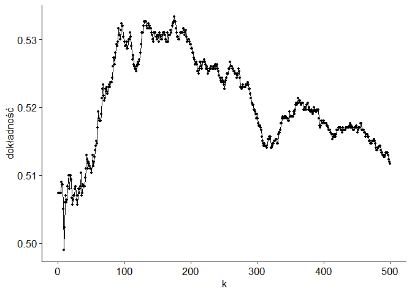
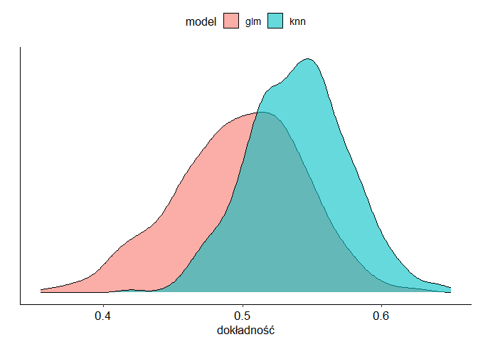
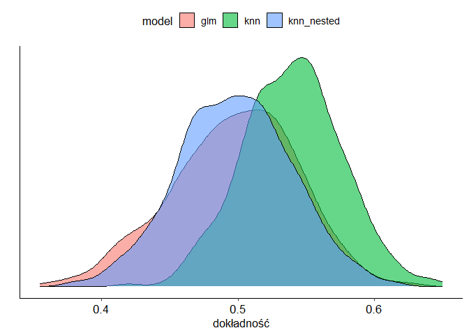

O zagnieżdżonej walidacji krzyżowej
================

Chcemy policzyć średni wzrost człowieka. Bierzemy próbę losową z
populacji i liczymy średnią arytmetyczną. Jest to dobry estymator
rzeczywistej średniej. Co prawda prawie na pewno nie dostaniemy
dokładnego wyniku, ale średnio rzecz biorąc, nie będzie ani
przeszacowany, ani niedoszacowany.

Powtórzmy jednak tę procedurę 100 razy, tzn. bierzemy wiele prób i z
każdej liczymy średnią. Oczywiście każda z nich jest dobrym estymatorem
średniej populacyjnej. Ale teraz, z jakiegoś powodu, wybierzmy
największą z tych 100 średnich. To już nie jest dobry estymator
średniej, wynik będzie prawie na pewno przeszacowany.

Dzięki temu przykładowi łatwiej będzie zrozumieć, co za chwilę się
wydarzy.

## Dane

Poniżej symuluję proste dane dla problemu klasyfikacyjnego. 5
predyktorów, 10 tysięcy obserwacji, połowa należy do jednej klasy,
połowa do drugiej. Wartości predyktorów losuję z rozkładu normalnego
(choć to nie jest tu ważne). Klasy przyporządkowuję zupełnie losowo,
tzn. nie mają żadnego związku z predyktorami.

Użyję dwóch modeli, regresji logistycznej i KNN. Porównam je przy pomocy
dokładności (*accuracy*). I ponieważ w danych nie ma żadnego sygnału,
tylko szum, oczekuję wyniku na poziomie 0,5.

Wydzielam nietypowo duży zbiór testowy (9 tysięcy obserwacji).
Potraktujmy go jednak NIE jako klasyczny zbiór testowy, na którym
dokonuje się ostatecznej ewaluacji modelu. Zamiast tego załóżmy, że mamy
dostęp tylko do zbioru treningowego (tysiąc obserwacji). Ten rzekomy
zbiór testowy to nowe dane, które napłyną w przyszłości — i nie mamy do
nich dostępu.

W takim razie, skoro mamy tylko tysiąc obserwacji, podejmujemy decyzję
(poniekąd słuszną), że nie będziemy wydzielać “prawdziwego” zbioru
testowego. Żeby jednak wiarygodnie ocenić, jak dobry jest model, użyjemy
walidacji krzyżowej (5-fold CV, powtarzane 3 razy).

## Regresja logistyczna vs. KNN

Używając regresji logistycznej, otrzymałem dokładność 0,5, jak należało
się spodziewać. Ale może da się lepiej? Może wyciągniemy coś z tego
szumu, dopasowując “lepszy” model? Spróbujmy z KNN. Poniżej dokładność
dla różnej liczby sąsiadów.

Wygląda na to, że się udało, KNN zauważył coś w danych. Dla 175 sąsiadów
dokładność wynosi 0,53. Błąd standardowy jest niski (0,007), więc można
powiedzieć, że KNN jest tu istotnie lepszy regresji logistycznej (choć R
niepoprawnie liczy błąd standardowy, zakładając, że szacowane
dokładności są niezależne, podczas gdy stosowaliśmy powtarzaną
kroswalidację).

Oczywiście tak naprawdę to regresja logistyczna jest lepsza, bo przecież
nie ma tu żadnego sygnału. Ale skąd mamy to wiedzieć, przecież w
rzeczywistości nie znamy modelu, który tworzył dane. W takim razie ufamy
temu, co otrzymaliśmy, i sprzedajemy klientowi model KNN, mówiąc, że
“działa”. Co prawda wydaje się, że kiepsko, ale to oczywiście kwestia
relatywna. Te 3 punkty procentowe ponad rzut monetą mogą przełożyć się
na realny zysk.

## Co na to klient?

Klient stosuje model na nowych danych. Uruchomiłem go na tych 9
tysiącach obserwacji, które wygenerowałem dodatkowo, i otrzymałem
dokładność 0,492. Jest nawet gorzej, niż rzucając monetą, choć dla
naszej historii nie to jest kluczowe — ale to, że wynik uzyskany na
danych treningowych nie przeniósł się na zbiór testowy. Cóż, klient nie
będzie zadowolony.

A co z regresją logistyczną? Tym razem otrzymałem 0,505. Wynik jest
lepszy, ale jak pisałem wyżej, nie o to tu chodzi. Ważne, że tak samo
jak regresja NIE działała na zbiorze treningowym, tak samo NIE działa na
nowych danych. Bazując na wynikach regresji w ogóle nie
zaimplementowalibyśmy modelu w firmie — bo zmiennej *Y* nie da się
przewidzieć na podstawie dostępnych informacji *X*. I byłaby to słuszna
decyzja. Decydując się na KNN, nie tylko wybraliśmy nieoptymalny model,
ale na dodatek w ogóle jakiś wybraliśmy, wyrzucając pieniędze w błoto.

## Co KNN znalazł?

Ale skąd ten wynik dla KNN? Co on tam znalazł? Najwyraźniej dla pewnej
liczby sąsiadów da się odszukać w danych treningowych coś, co
“reprodukuje” się na inny podzbiór danych treningowych. Sprawdzałem dużo
możliwości (liczba sąsiadów od 1 do 500) i wybrałem akurat tę, dla
której uzyskałem najlepszy wynik.

Żeby tylko nie umknęło nam sedno. Tu nie chodzi o taki klasyczny
*overfitting* (tzn. w pewnym sensie jest to overfitting, ale innego
rodzaju). Przecież zgodnie ze sztuką przeprowadziliśmy kroswalidację!
Model był ewaluowany na danych, których nie widział, gdy był
konstruowany.

## Stop

Ale chwila, zanim napiszę, jak można zaradzić temu problemowi, bądźmy
bardziej krytyczni wobec tego, co tutaj chcę udowodnić. Może wylosowałem
dane pod tezę? Ustawiłem sobie jakieś konkretne ziarno (`set.seed(10)`),
pewnie dla innych nie dostałem tego, co chciałem?

Tak, rzeczywiście taki efekt może być kwestią przypadku. Powiem więcej:
naprawdę zmieniałem ziarno, żeby pokazać to, co chcę pokazać…

Od razu jednak uspokajam, że problem, który opisuję, jak najbardziej
istnieje — natomiast nie w każdym przypadku będzie on widoczny. Żeby to
udowodnić, trzeba jednak wielokrotnie przejść przez całą tę procedurę,
którą tu opisałem, począwszy od generowania danych. No to zróbmy to!

## Symulacje

Napisałem funkcję, które generuje dane, oraz dwie dodatkowe, które
dopasowują modele regresji logistycznej i KNN. Żeby cały proces był
szybszy, liczbę obserwacji zredukowałem do 200, a walidację krzyżową
wykonuję bez powtórzeń. Natomiast całą procedurę powtarzam 1000 razy.
Poniżej rozkład szacowanej dokładności.

Mam ich 1000 dla regresji logistycznej i 1000 dla KNN, mogłem więc
narysować te dwa wykresy gęstości. I jak widać, to wszystko, co próbuję
sprzedać, to nie jest przypadek, ale reguła. Oczywiście *reguła* w
sensie statystycznych, bo były symulacje, w których KNN zadziałał tak
samo lub gorzej od regresji logistycznej. Natomiast średnio rzecz
biorąc, zaprezentowane tu podejście z wyborem modelu jest błędne.

## Zagnieżdżona walidacja krzyżowa

Rozwiązaniem problemu byłaby oczywiście ewaluacja modelu na niezależnych
danych (zbiór testowy). Zwykle potrzebę wydzielenia takiego zbioru
uzasadnia się tym, że chcemy po prostu wiarygodnie ocenić, jakiej
dokładności spodziewać się na nowych danych. To oczywiście prawda, ale
chcę podkreślić, że w naszym problemie nie chodzi jedynie o końcową
ewaluację, ale bez takiego zbioru testowego nie jesteśmy w stanie
wiarygodnie *wybrać* modelu.

Można powiedzieć, że bez zbioru testowego regresja logistyczna już na
starcie ma trudniej. Bo brak jej hiperparametrów, które można by
zmieniać. W powyższych przykładach nie porównujemy jednego modelu
(regresja logistyczna) z drugim (KNN), ale jeden model z setką modeli
KNN.

Świetnie, tylko że nie stać nas na wydzielenie zbioru testowego — mamy
za mało obserwacji. Swoją drogą, najlepszym rozwiązaniem w takiej
sytuacji może być po prostu zrezygnowanie z modeli, które mają wiele
hiperparametrów. Nie tylko dlatego, że nie umiemy dobrze ocenić, jak
działają, ale prostsze modele mogą zwyczajnie sprawdzać się lepiej.
Idziemy jednak w zaparte i chcemy użyć KNN.

Gdy mamy zbyt mało danych do wydzielenia jednego zbioru testowego (czyli
prawie zawsze), rozwiązaniem jest walidacja krzyżowa. Problem w tym, że
już jej użyliśmy — do wyboru hiperparametrów. W takim razie trzeba ją
zagnieździć ([nested
cross-validation](https://www.tidymodels.org/learn/work/nested-resampling/)).
Zaczynamy od wydzielenia wielu zbiorów walidacyjnych, a następnie
wewnątrz każdego z nich testujemy hiperparametry, robiąc kolejną
walidację krzyżową.

W R (`tidymodels`) jest funkcja, które generuje takie zagnieżdżone
podzbiory, ale wyboru hiperparametrów nie da się już łatwo zrobić, także
musiałem napisać swoje funkcje. I ogólnie zagnieżdżona walidacja jest
dość męcząca i nie dziwi mnie, że sporo osób jej nie wykonuje. Na
dodatek rośnie złożoność obliczeniowa i wykorzystujemy mniej danych do
wyboru hiperparametrów.

Użyłem 5-fold CV jako zewnętrzna pętla, a w środku (czyli do wyboru
hiperparametrów) 3-fold CV. Poniżej wyniki (dorzuciłem do poprzedniego
wykresu model KNN, ale dla dokładności liczonej przy pomocy
zagnieżdżonej walidacji).

No dobrze, może jest to męczące, ale daje prawidłowe rezultaty: wykres
pokrywa się z regresją logistyczną. Innymi słowy, zachowanie KNN, które
zaobserwowaliśmy, to nie był problem z algorytmem, ale ze sposobem
walidacji.

## Konkluzja

Zacząłem od przykładu z estymacją średniego wzrostu. Odnieśmy go jeszcze
wyraźnie do tego, co się tutaj wydarzyło. Jeśli przyjmiemy pewne *k*
(liczbę sąsiadów) i przy pomocy kroswalidacji policzymy dokładność,
będzie to jej wiarygodny estymator. Innymi słowy, dla każego *k* używamy
wiarygodnego estymatora. Ale potem bierzemy maksimum…

Ktoś tu jeszcze może podnieść alarm, że analogia nie jest najlepsza, bo
bierzemy różne *k*, więc szacujemy dokładność nie dla tego samego
modelu, ale dla różnych. Ale tak naprawdę chodzi nam nie tyle o
oszacowanie, jak działa model dla konkretnego *k*, ale ogólnie co można
wyciągnąć z KNN. I właśnie to oszacowanie jest zawyżone.

To zjawisko można jeszcze powiązać z problemem wielokrotnego testowania.
Ale o tym kiedy indziej.
