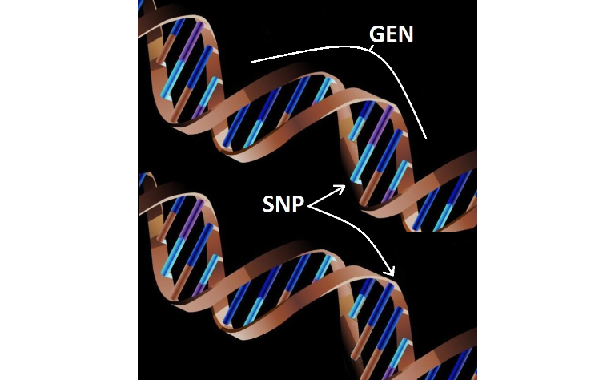

Jak znaleźć istotne geny?
================

## Geny i SNP

Najpierw krótki wstęp genetyczny, bo bez niego ciężko będzie zrozumieć,
o co chodzi w analizowanych przeze mnie danych. Będziemy szukać genów,
więc zacznijmy od tego, co ten termin oznacza. Gen możemy rozumieć jako
fragment łańcucha DNA, który ma znaczenie (wpływa na jakąś cechę), i
który występuje przynajmniej w dwóch wersjach, tak zwanych allelach. W
zależności od tego, czy mamy gen w wersji *A* lub *a*, może to skutkować
na przykład wyższym ryzykiem zachorowania na pewną chorobę.

Dalej, to, co nas najbardziej interesuje w budowie DNA, to zasady
azotowe. Zwykle występują w czterech wersjach: adenina, cytozyna,
guanina i tymina. Jeśli porównamy dwa łańcuchy DNA przypadkowych
przechodniów, będę w 99,9% takie same. Różnice polegają na tym, że w
tych samych miejscach w łańcuchu występują różne zasady azotowe. Zasada
azotowa jest składnikiem nukleotydu i na potrzeby tego tekstu te dwa
terminy będę stosował zamiennie.

U zwierząt i roślin zwykle szukamy dłuższych fragmentów DNA, które mogą
wystąpić w różnych wersjach, natomiast u ludzi najczęściej rozpatrujemy
każdy z nukleotydów z osobna, a te, które przynajmniej u jednego
procenta osób wyglądają inaczej niż u reszty, to tak zwane polimorfizmy
pojedynczego nukleotydu (*Single Nucleotide Polymorphism*, SNP, “snip”).

Na poniższym rysunku zaprezentowano, jak zwykle wyglądają gen i SNP.
Trzeba jednak odnotować, że genem może być również pojedynczy nukleotyd
i wtedy te pojęcia są tożsame.



## Lokalizacja genów

Szukanie (lokalizacja) genów, to próba wskazania, które z nich są
związane z interesującą nas cechą. “Związane” oznacza, że to, w jakiej
wersji dany gen występuje, koreluje z cechą. Do czego nam to potrzebne?
Dzięki takiej informacji możemy np. lepiej zrozumieć przyczynę choroby i
tym samym opracować skuteczniejszy lek. Jesteśmy również w stanie
znacznie szybciej oszacować ryzyko zachorowania i wcześniej zacząć
terapię. U zwierząt, na przykład u krów, jeśli odkryjemy, które geny są
odpowiedzialne na przykład za mleczność, możemy krzyżować tylko pewne
osobniki. A jeśli chcemy, by w naszym sadzie rosły tylko słodkie owoce,
zamiast przez kilkadziesiąt lat krzyżować różne odmiany, szukając
optymalnych cech, możemy od razu użyć tych o odpowiednich parametrach.

## Kodowanie

Spróbujmy przetłumaczyć informację o genotypach danego osobnika na
liczby. Oznaczyliśmy wcześniej allele genu przez *A* i *a*, co może
wydać się nierozsądne, bo jaki symbol wybrać dla trzeciego allelu?
Okazuje się, że taka sytuacja, tzn. wystąpienie trzeciej lub kolejnej
wersji, jest na tyle mało prawdopodobna, że najczęściej w ogóle się tej
szansy nie uwzględnia. Wynika to z faktu, że mutacja w jakimś miejscu
DNA należy do rzadkości, więc kolejna w tym samym prawie się nie zdarza.

Moglibyśmy zatem kodować informację genetyczną przy pomocy jedynie dwóch
liczb, ale trzeba jeszcze uwzględnić, że DNA znajduje się w
chromosomach, które występują w parach. W odpowiadających sobie
chromosomach nie mamy tych samych ciągów, gdyż jedną nić dziedziczymy po
matce, drugą po ojcu. Zatem w danym miejscu ciągu DNA mamy trzy
możliwości: *aa*, *aA* (ewentualnie *Aa*, ale kolejność nie ma
znaczenia) lub *AA*.

Podsumowując, dla każdego osobnika możemy podać ciąg genotypów,
kodowanych na przykład jako 0, 1 i 2, oraz wartość interesującej nas
cechy. Poszczególne genotypy będą jakościowymi zmiennymi objaśniającymi,
a cecha zmienną objaśnianą. Chcemy znaleźć te zmienne, które mają
istotny wpływ na cechę.

Ponieważ będę analizował dane ludzkie, zmienne objaśniające to SNP. W
dalszej części tekstu będę używał kolokwialnej nazwy “snipy”, żeby
łatwiej się czytało.

## Dane

Wykorzystam dane
[stąd](https://www.kaggle.com/datasets/seascape/snp-dataset-for-gwas).
Nie są to rzeczywiste dane, ale bardzo do nich podobne. Cecha jest
symulowana, dzięki czemu wiemy, jakie snipy rzeczywiście na nią
wpływają. Wszystkich jest prawie pół miliona, a na dodatek obserwacji
znacznie mniej niż zmiennych (1000). Jednym słowem, zadanie, które przed
nami stoi, jest bardzo trudne. I jest to raczej typowa sytuacja dla tego
typu danych.

## Model

Najprostszym podejściem byłoby skorelowanie każdego snipa z cechą, np.
przy pomocy testu ANOVA (tzw. pojedyncze testy, *single tests*). Jest to
jednak kiepskie rozwiązanie. Po pierwsze, mamy tu ogromny problem z
wielokrotnym testowaniem i nie jest łatwo wybrać rozsądną korektę. Po
drugie, wiadomo z genetyki, że wpływ na cechę ma pewna grupa snipów i
nie jest to wpływ niezależny. Wykonując pojedyncze testy, zupełnie to
ignorujemy. Możemy nie znaleźć któregoś snipa, bo jego istotny wpływ
ujawnia się dopiero, gdy uwzględnimy wpływ innych. Oprócz tego z powodu
wysokiej korelacji między bliskimi snipami, takie pojedyncze testy
wskażą nam całą grupę bardzo podobnych snipów, zamiast wybrać
reprezentanta.

Lepszym podejściem jest zastosowanie regresji liniowej i kryteriów
wyboru modelu, jak AIC czy BIC. Problem w tym, że nie są one
przystosowane do sytuacji, z którą mamy do czynienia. Zostały tak
zaprojektowane, że w pewien sposób preferują modele, które składają się
mniej więcej z połowy dostępnych zmiennych. Nawet jeśli świat tak
wygląda (tzn. wpływ na cechę ma bardzo dużo snipów), to technicznie nie
jesteśmy w stanie zbudować takiego modelu (zbyt mało obserwacji). Zwykle
jednak zakłada się, że istotny wpływ na cechę ma kilkanaście,
ewentualnie kilkadziesiąt snipów.

Jak powiedziałem, AIC i BIC nie wybiorą takiego modelu, gdyż kara za
jego rozmiar (liczbę zmiennych) jest w nich zbyt niska. Dlatego
zastosuję [kryterium
mBIC](https://www.researchgate.net/publication/8469694_Modifying_the_Schwarz_Bayesian_Information_Criterion_to_Locate_Multiple_Interacting_Quantitative_Trait_Loci),
w który jest ona znacznie większa.

Oprócz tego jest jeszcze problem techniczny, gdyż dane są bardzo duże.
Wykorzystam pakiet
[bigstep](https://cran.rstudio.com/web/packages/bigstep/vignettes/bigstep.html),
który umożliwia zastosowanie procedury *stepwise selection* na bardzo
dużych danych (oraz ma zaimplementowane kryterium mBIC).

## Data science?

Tu krótka dygresja. Termin “data science” rozumie się na różne sposoby.
Czasem jako po prostu analizę danych, w której nie wykraczamy poza
standardowe procedury. I dobrze, jeśli problem tego nie wymaga, nie ma
sensu na siłę stosować jakichś wyrafinowanych technik. Ale chyba słowo
“science” najbardziej pasuje do tego, co robimy tutaj. Problem wymaga,
byśmy najpierw wykonali pewien “research”. A z racji tego, że zadanie
jest specyficzne, może się okazać, że rozwiązanie znajdziemy jedynie w
publikacjach naukowych.

Co gorsze, ta odpowiedź może być tylko teoretyczna i następnie sami
będziemy musieli stworzyć narzędzie, by móc przeprowadzić analizę.
Akurat w naszym przypadku to narzędzie (pakiet w R) jest.

## Analiza

Ponieważ dane są duże (ok. 1 GB), nie wczytuję ich do RAM, ale
wykorzystuję funkcję `read.big.matrix()` z pakietu `bigmemory`
(`bigstep` współpracuje z tym pakietem).

``` r
library("bigstep")
library("bigmemory")

X <- read.big.matrix("X.txt", sep = " ", type = "char", head = TRUE)
y <- read.table("y.txt")
```

Funkcja `prepare_data()` łączy dane X i Y, tworząc obiekt klasy `big`.

``` r
snp_data <- prepare_data(y, X, verbose = FALSE) 
```

Snipów będę szukał przy pomocy poniższej procedury.

``` r
results <- snp_data %>% 
  reduce_matrix(minpv = 0.15) %>% 
  fast_forward(crit = bic, maxf = 70) %>% 
  multi_backward(crit = mbic) %>% 
  stepwise(crit = mbic)
```

    ##   |                                                                              |                                                                      |   0%  |                                                                              |                                                                      |   1%  |                                                                              |=                                                                     |   1%  |                                                                              |=                                                                     |   2%  |                                                                              |==                                                                    |   2%  |                                                                              |==                                                                    |   3%  |                                                                              |==                                                                    |   4%  |                                                                              |===                                                                   |   4%  |                                                                              |===                                                                   |   5%  |                                                                              |====                                                                  |   5%  |                                                                              |====                                                                  |   6%  |                                                                              |=====                                                                 |   7%  |                                                                              |=====                                                                 |   8%  |                                                                              |======                                                                |   8%  |                                                                              |======                                                                |   9%  |                                                                              |=======                                                               |   9%  |                                                                              |=======                                                               |  10%  |                                                                              |=======                                                               |  11%  |                                                                              |========                                                              |  11%  |                                                                              |========                                                              |  12%  |                                                                              |=========                                                             |  12%  |                                                                              |=========                                                             |  13%  |                                                                              |==========                                                            |  14%  |                                                                              |==========                                                            |  15%  |                                                                              |===========                                                           |  15%  |                                                                              |===========                                                           |  16%  |                                                                              |============                                                          |  17%  |                                                                              |============                                                          |  18%  |                                                                              |=============                                                         |  18%  |                                                                              |=============                                                         |  19%  |                                                                              |==============                                                        |  19%  |                                                                              |==============                                                        |  20%  |                                                                              |==============                                                        |  21%  |                                                                              |===============                                                       |  21%  |                                                                              |===============                                                       |  22%  |                                                                              |================                                                      |  22%  |                                                                              |================                                                      |  23%  |                                                                              |=================                                                     |  24%  |                                                                              |=================                                                     |  25%  |                                                                              |==================                                                    |  25%  |                                                                              |==================                                                    |  26%  |                                                                              |===================                                                   |  27%  |                                                                              |===================                                                   |  28%  |                                                                              |====================                                                  |  28%  |                                                                              |====================                                                  |  29%  |                                                                              |=====================                                                 |  29%  |                                                                              |=====================                                                 |  30%  |                                                                              |=====================                                                 |  31%  |                                                                              |======================                                                |  31%  |                                                                              |======================                                                |  32%  |                                                                              |=======================                                               |  32%  |                                                                              |=======================                                               |  33%  |                                                                              |=======================                                               |  34%  |                                                                              |========================                                              |  34%  |                                                                              |========================                                              |  35%  |                                                                              |=========================                                             |  35%  |                                                                              |=========================                                             |  36%  |                                                                              |==========================                                            |  36%  |                                                                              |==========================                                            |  37%  |                                                                              |==========================                                            |  38%  |                                                                              |===========================                                           |  38%  |                                                                              |===========================                                           |  39%  |                                                                              |============================                                          |  39%  |                                                                              |============================                                          |  40%  |                                                                              |============================                                          |  41%  |                                                                              |=============================                                         |  41%  |                                                                              |=============================                                         |  42%  |                                                                              |==============================                                        |  42%  |                                                                              |==============================                                        |  43%  |                                                                              |===============================                                       |  44%  |                                                                              |===============================                                       |  45%  |                                                                              |================================                                      |  45%  |                                                                              |================================                                      |  46%  |                                                                              |=================================                                     |  47%  |                                                                              |=================================                                     |  48%  |                                                                              |==================================                                    |  48%  |                                                                              |==================================                                    |  49%  |                                                                              |===================================                                   |  49%  |                                                                              |===================================                                   |  50%  |                                                                              |===================================                                   |  51%  |                                                                              |====================================                                  |  51%  |                                                                              |====================================                                  |  52%  |                                                                              |=====================================                                 |  52%  |                                                                              |=====================================                                 |  53%  |                                                                              |======================================                                |  54%  |                                                                              |======================================                                |  55%  |                                                                              |=======================================                               |  55%  |                                                                              |=======================================                               |  56%  |                                                                              |========================================                              |  57%  |                                                                              |========================================                              |  58%  |                                                                              |=========================================                             |  58%  |                                                                              |=========================================                             |  59%  |                                                                              |==========================================                            |  59%  |                                                                              |==========================================                            |  60%  |                                                                              |==========================================                            |  61%  |                                                                              |===========================================                           |  61%  |                                                                              |===========================================                           |  62%  |                                                                              |============================================                          |  62%  |                                                                              |============================================                          |  63%  |                                                                              |============================================                          |  64%  |                                                                              |=============================================                         |  64%  |                                                                              |=============================================                         |  65%  |                                                                              |==============================================                        |  65%  |                                                                              |==============================================                        |  66%  |                                                                              |===============================================                       |  66%  |                                                                              |===============================================                       |  67%  |                                                                              |===============================================                       |  68%  |                                                                              |================================================                      |  68%  |                                                                              |================================================                      |  69%  |                                                                              |=================================================                     |  69%  |                                                                              |=================================================                     |  70%  |                                                                              |=================================================                     |  71%  |                                                                              |==================================================                    |  71%  |                                                                              |==================================================                    |  72%  |                                                                              |===================================================                   |  72%  |                                                                              |===================================================                   |  73%  |                                                                              |====================================================                  |  74%  |                                                                              |====================================================                  |  75%  |                                                                              |=====================================================                 |  75%  |                                                                              |=====================================================                 |  76%  |                                                                              |======================================================                |  77%  |                                                                              |======================================================                |  78%  |                                                                              |=======================================================               |  78%  |                                                                              |=======================================================               |  79%  |                                                                              |========================================================              |  79%  |                                                                              |========================================================              |  80%  |                                                                              |========================================================              |  81%  |                                                                              |=========================================================             |  81%  |                                                                              |=========================================================             |  82%  |                                                                              |==========================================================            |  82%  |                                                                              |==========================================================            |  83%  |                                                                              |===========================================================           |  84%  |                                                                              |===========================================================           |  85%  |                                                                              |============================================================          |  85%  |                                                                              |============================================================          |  86%  |                                                                              |=============================================================         |  87%  |                                                                              |=============================================================         |  88%  |                                                                              |==============================================================        |  88%  |                                                                              |==============================================================        |  89%  |                                                                              |===============================================================       |  89%  |                                                                              |===============================================================       |  90%  |                                                                              |===============================================================       |  91%  |                                                                              |================================================================      |  91%  |                                                                              |================================================================      |  92%  |                                                                              |=================================================================     |  92%  |                                                                              |=================================================================     |  93%  |                                                                              |==================================================================    |  94%  |                                                                              |==================================================================    |  95%  |                                                                              |===================================================================   |  95%  |                                                                              |===================================================================   |  96%  |                                                                              |====================================================================  |  96%  |                                                                              |====================================================================  |  97%  |                                                                              |====================================================================  |  98%  |                                                                              |===================================================================== |  98%  |                                                                              |===================================================================== |  99%  |                                                                              |======================================================================|  99%  |                                                                              |======================================================================| 100%

Poniżej tłumaczę, na czym polegają poszczególne kroki.

### 1. Wstępna redukcja zmiennych

Zaczynam od ograniczenia liczby zmiennych (funkcja `reduce_matrix()`).
Zostawiam tylko te snipy, które mogą korelować z cechą (p-wartość dla
korelacji Pearsona mniejsza od 0,15). Oczywiście trzeba uważać, bo
możemy tym sposobem usunąć ważnego snipa, którego wpływ daje się
zauważyć dopiero, gdy w modelu uwzględnimy inne. Tego typu sytuacje się
zdarzają, co pokażę pod koniec.

Ten próg 0,15 można oczywiście zwiększyć lub zmniejszyć, w zależności od
tego, jak szybki mamy komputer i ile czasu możemy przeznaczyć na
analizę.

Jak napisałem, wykorzystuję korelację Pearsona, co może wydawać się dość
zaskakujące. Zmienne objaśniające są jakościowe i przyjmują trzy
wartości (0, 1, 2). Lepszym podejściem byłby tu test ANOVA. Natomiast po
pierwsze, te kategorie zmiennych mają pewien naturalny porządek (wersja
typowa na obu chromosomach, nietypowa na jednym, nietypowa na dwóch).
Wciąż to nie brzmi jak korelacja Pearsona, bo przecież związek między
taką zmienną a cechą nie musi być liniowy. Ale podejdziemy do tego w ten
sposób, bo tak będzie szybciej…

Kiepski argument? Po pierwsze, w problemach biznesowych czas jest bardzo
ważnym czynnikiem. Jeśli budujemy model, musimy minimalizować nie tylko
błąd, ale też koszt wykonania takiego modelu (a więc i czas). Po drugie,
dalej i tak będę korzystał z regresji liniowej, także na relacje ze
snipami będę patrzył liniowo. Po trzecie, naszym zadaniem jest nie tyle
stworzyć dobry model (parametry jak najbliższe prawdzie), ale znaleźć
istotne zmienne. A to zwykle jest prostsze: nawet jeśli nie założymy
poprawnej postaci relacji między zmiennymi, jest duża szansa, że ją
zauważymy (otrzymamy niską p-wartość).

### 2. Wstępny model

W drugim kroku stosuję szybką procedurę `fast_forward()`, która dołącza
zmienne na podstawie klasycznego kryterium BIC. Działa ona na takiej
zasadzie, że poprzedni krok (redukcja snipów) dodatkowo ustawia zmienne
w kolejności od najmocniej do najsłabiej skorelowanej z cechą. Funkcja
`fast_forward()` próbuje w tej kolejność dołączyć zmienne do modelu, o
ile polepszają wartość kryterium BIC. Tzn. nie szuka NAJLEPSZEJ zmiennej
minimalizującej BIC, ale dołącza każdą, która to kryterium zmniejsza —
dzięki temu działa to bardzo szybko. Gdy zmiennych jest już odpowiednio
dużo (u mnie 70), kończymy. Dzięki temu etapowi tanim kosztem dostajemy
wstępny, dość duży model.

Teoretycznie można by już na tym etapie stosować mBIC, ale z powodu
znacznie większej kary, nie zbudowalibyśmy odpowiednio dużego modelu.

### 3. Odrzucenie zmiennych

Przechodzę do procedury *backward* (funkcja `multi_backward()`). Stosuję
ją w standardowy sposób, tzn. szukam najgorszej zmiennej i ją usuwam, o
ile zmniejszy to wartość kryterium. Tu już korzystam z mBIC. Ta funkcja
również jest szybka, bo procedura *backward* jest szybka: testujemy
tylko zmienne, które są w modelu, a jest ich stosunkowo niewiele (w
porównaniu do ogromnej liczby zmiennych poza modelem).

### 4. Stepwise

W końcu poruszam się w obu kierunkach (`stepwise()`). Ten etap jest
potencjalnie najbardziej czasochłonny, bo krok *forward* jest trudny
(jak pisałem wyżej). Choć może się zdarzyć, że już dzięki poprzednim
etapom wybierzemy najlepszy model, wtedy `stepwise()` szybko się
skończy.

## Wyniki

Możemy podsumować otrzymany model przy pomocy funkcji `summary()`

``` r
summary(results)
```

    ## 
    ## Call:
    ## lm(formula = y ~ ., data = as.data.frame(Xm[, -1]))
    ## 
    ## Residuals:
    ##     Min      1Q  Median      3Q     Max 
    ## -3.1680 -0.6159  0.0070  0.6161  3.2185 
    ## 
    ## Coefficients:
    ##                Estimate Std. Error t value Pr(>|t|)    
    ## (Intercept)   -10.03474    0.21223 -47.282   <2e-16 ***
    ## CH11_SNP20057   0.49263    0.04353  11.317   <2e-16 ***
    ## CH03_SNP2703    0.52758    0.04402  11.984   <2e-16 ***
    ## CH12_SNP3421    0.49850    0.04606  10.822   <2e-16 ***
    ## CH02_SNP22034   0.55114    0.04344  12.688   <2e-16 ***
    ## CH11_SNP12611   0.56236    0.04357  12.908   <2e-16 ***
    ## CH15_SNP3859    0.52568    0.04487  11.716   <2e-16 ***
    ## CH19_SNP1377    0.46536    0.04426  10.514   <2e-16 ***
    ## CH18_SNP1031    0.47029    0.04543  10.352   <2e-16 ***
    ## CH02_SNP39189   0.45030    0.04532   9.937   <2e-16 ***
    ## CH05_SNP7371    0.41880    0.04541   9.223   <2e-16 ***
    ## CH01_SNP27796   0.52724    0.04398  11.989   <2e-16 ***
    ## CH17_SNP4306    0.50504    0.04346  11.621   <2e-16 ***
    ## CH08_SNP15190   0.51307    0.04407  11.642   <2e-16 ***
    ## CH19_SNP6377    0.46044    0.04409  10.443   <2e-16 ***
    ## CH22_SNP33      0.50436    0.04515  11.171   <2e-16 ***
    ## CH03_SNP10844  -0.43332    0.04544  -9.536   <2e-16 ***
    ## CH10_SNP445    -0.46346    0.04392 -10.552   <2e-16 ***
    ## CH01_SNP32763   0.57154    0.04370  13.079   <2e-16 ***
    ## CH01_SNP19810   0.53394    0.04528  11.791   <2e-16 ***
    ## CH06_SNP25838   0.52477    0.04466  11.751   <2e-16 ***
    ## CH16_SNP4525    0.50186    0.04366  11.496   <2e-16 ***
    ## CH14_SNP7000    0.41281    0.04502   9.169   <2e-16 ***
    ## CH10_SNP8265    0.40779    0.04428   9.210   <2e-16 ***
    ## CH04_SNP5128    0.53264    0.04409  12.081   <2e-16 ***
    ## ---
    ## Signif. codes:  0 '***' 0.001 '**' 0.01 '*' 0.05 '.' 0.1 ' ' 1
    ## 
    ## Residual standard error: 0.9745 on 975 degrees of freedom
    ## Multiple R-squared:  0.7716, Adjusted R-squared:  0.7659 
    ## F-statistic: 137.2 on 24 and 975 DF,  p-value: < 2.2e-16

Znaleźliśmy 24 snipy. Ponieważ cecha była symulowana, możemy sprawdzić,
jak nam poszło, porównując znalezione snipy z prawdziwymi, podanymi w
opisie danych. I okazuje się, że znaleźliśmy wszystkie. Niektóre na
trochę innej pozycji (np. CH10_SNP445 zamiast CH10_SNP444), co wynika z
bardzo wysokiej korelacji między tak bliskimi snipami.

Co interesujące, chociaż snip CH01_SNP19810 jest ważny (i ma bardzo
niską p-wartość w modelu regresji), jest bardzo trudny do odnalezienia.
Korelacja między nim a cechą jest bardzo niska:

``` r
cor.test(X[, "CH01_SNP19810"], y[[1]])
```

    ## 
    ##  Pearson's product-moment correlation
    ## 
    ## data:  X[, "CH01_SNP19810"] and y[[1]]
    ## t = 1.6186, df = 998, p-value = 0.1058
    ## alternative hypothesis: true correlation is not equal to 0
    ## 95 percent confidence interval:
    ##  -0.01085764  0.11280513
    ## sample estimates:
    ##        cor 
    ## 0.05116989

P-wartość wynosi 0,106, więc jeśli parametr `minpv` w pierwszym kroku
nie byłby odpowiednio duży, tego snipa w ogóle byśmy nie znaleźli! To
pokazuje, jak w tego typu problemach ważny jest odpowiedni model.
