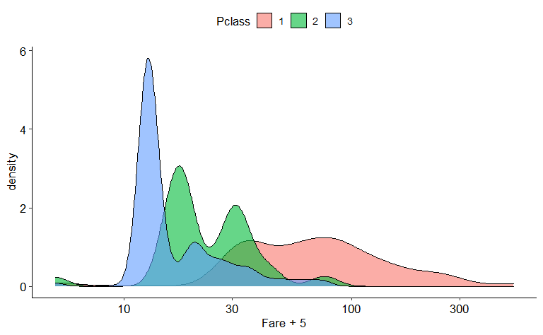
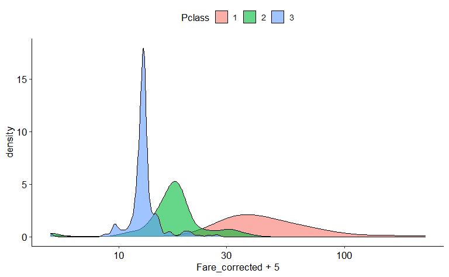
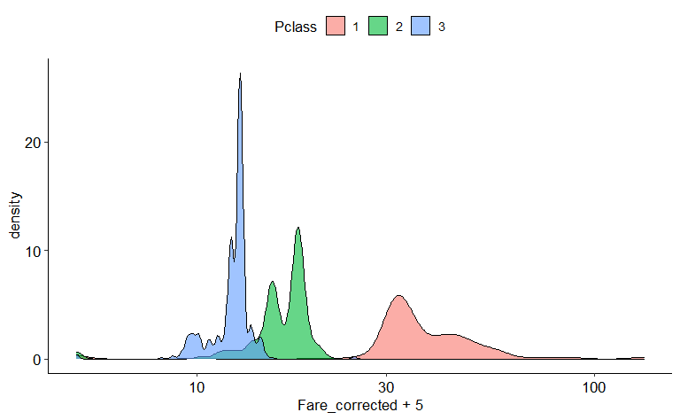

Jak przewidzieć klasę biletu pasażera Titanica?
================

Na wstępie muszę przyznać, że zawsze trochę śmieszyło mnie, że akurat
dane z katastrofy Titanica stały się jednymi z najpopularniejszych w
uczeniu maszynowym, jako przykład problemu klasyfikacyjnego. Cóż nam z
modelu, który przewiduje przeżycie tej katastrofy? Do jakich innych
danych można by go wykorzystać? Oczywiście zdaję sobie sprawę, że możemy
porównywać różne algorytmy uczenia maszynowego na jakich danych chcemy,
mimo to ta niepraktyczność jest dość zabawna, szczególnie jeśli
pomyślimy, jak duży sukces odniosło uczenie maszynowe w rzeczywistych
problemach biznesowych.

Trzeba też dodać, że modele uczenia maszynowego można wykorzystać nie
tylko do prognozy nowych przypadków, ale również do imputacji braków
danych. I powiedzmy, że to jest problem, których chciałym rozwiązać w
tej analizie. Jednak nie będę modelował przeżycia, ale klasę biletu, na
podstawie wybranych cech. I moim celem nie jest zbudowanie najlepszego
modelu, ale pokazanie pewnego problemu ze zmienną *Fare* — oraz jak duży
ma to wpływ na model.

Dane wziąłęm stąd (<https://www.kaggle.com/competitions/titanic>) i są
podzielone na dwa pliki, *train* i *test*. Zaczynam od danych *train*,
ale ostateczne ten drugi plik również użyję.

``` r
library("tidyverse")
library("nnet")
library("yardstick")
theme_set(ggpubr::theme_pubr(base_size = 13))

titanic <- read_csv("data/train.csv")

titanic <- titanic %>% 
  mutate(
    Embarked = as.factor(Embarked),
    Sex = as.factor(Sex),
    Survived = as.factor(Survived),
    Pclass = as.factor(Pclass)
  ) %>% 
  mutate(Family = SibSp + Parch) %>% 
  drop_na(Embarked)

count(titanic, Pclass)
```

    ## # A tibble: 3 x 2
    ##   Pclass     n
    ##   <fct>  <int>
    ## 1 1        214
    ## 2 2        184
    ## 3 3        491

## Pierwsze podejście

Mamy trzy klasy biletu, użyję uogólnionej regresji logistycznej.
Ponieważ nie interesuje mnie interpretacja zależności, przejdę od razu
do podsumowania zdolności predykcyjnej. Zacznę od bardzo prostego
modelu, do przewidywania klasy biletu użyję tylko zmiennej *Fare*.

``` r
(Pclass ~ Fare) %>% 
  multinom(titanic, trace = FALSE) %>% 
  predict() %>% 
  accuracy_vec(titanic$Pclass, .) %>% 
  round(2)
```

    ## [1] 0.69

Dokładność wynosi 69%, co jest chyba kiepskim wynikiem, z uwagi na to,
że cena biletu powinna być bardzo silnie związana z jego klasą. Możemy
ten wynik poprawić, dorzucając inne informacje:

``` r
(Pclass ~ Fare + Survived + Sex + Family + Embarked) %>% 
  multinom(titanic, trace = FALSE) %>% 
  predict() %>% 
  accuracy_vec(titanic$Pclass, .) %>% 
  round(2)
```

    ## [1] 0.84

Jest lepiej, dodatkowe zmienne musiały w pewien sposób skorygować
zależność ze zmienną *Fare*. Ale może jesteśmy w stanie zrobić to sami?

## Korekta zmiennej Fare

Sprawdźmy, jak rozkłada się ta zmienna z podziałem na klasę biletu.
Wykres jest w skali logarytmicznej i musiałem coś dodać do *Fare*, bo w
paru przypadkach równa się 0.

``` r
ggplot(titanic, aes(Fare + 5, fill = Pclass)) +
  geom_density(alpha = 0.6) +
  scale_x_log10()
```



Silna zależność! Ale chwila, czy nie powinna być wręcz idealna? Dlaczego
rozkłady nakładają się na siebie? Dlaczego mamy bilety trzeciej klasy,
które są droższe od biletów pierwszej klasy?

Ewidentnie jest problem z tą zmienną. Można go odkryć na różne sposoby,
np. dysponując precyzyjnym opisem danych. Załóżmy jednak, że nie mamy do
niego dostępu. Pokażę, w jaki sposób ja doszedłem, o co tu chodzi.

Najpierw zainteresowało mnie, że niektóre numery biletów się powtarzają:

``` r
count(titanic, Ticket, sort = TRUE) %>% 
  slice(1:5)
```

    ## # A tibble: 5 x 2
    ##   Ticket       n
    ##   <chr>    <int>
    ## 1 1601         7
    ## 2 347082       7
    ## 3 CA. 2343     7
    ## 4 3101295      6
    ## 5 347088       6

Następnie przyjrzałem się bliżej wybranemu biletowi:

``` r
filter(titanic, Ticket == "CA. 2343") %>% 
  select(Pclass:Fare)
```

    ## # A tibble: 7 x 8
    ##   Pclass Name                               Sex     Age SibSp Parch Ticket  Fare
    ##   <fct>  <chr>                              <fct> <dbl> <dbl> <dbl> <chr>  <dbl>
    ## 1 3      "Sage, Master. Thomas Henry"       male     NA     8     2 CA. 2~  69.6
    ## 2 3      "Sage, Miss. Constance Gladys"     fema~    NA     8     2 CA. 2~  69.6
    ## 3 3      "Sage, Mr. Frederick"              male     NA     8     2 CA. 2~  69.6
    ## 4 3      "Sage, Mr. George John Jr"         male     NA     8     2 CA. 2~  69.6
    ## 5 3      "Sage, Miss. Stella Anna"          fema~    NA     8     2 CA. 2~  69.6
    ## 6 3      "Sage, Mr. Douglas Bullen"         male     NA     8     2 CA. 2~  69.6
    ## 7 3      "Sage, Miss. Dorothy Edith \"Doll~ fema~    NA     8     2 CA. 2~  69.6

Wszyscy podróżujący mają to samo nazwisko, zapewnie jest to rodzina. Co
zaskakujące, mimo że kupili bilety trzeciej klasy, zapłacili za niego
prawie 70\$! Patrząc na wykres, tyle kosztują bilety pierwszej klasy.
Chyba jest jasne, o co chodzi: jest to bilet grupowy i w zmiennej Fare
mamy jego całkowitą cenę.

W takim razie jeśli chcemy na podstawie ceny przewidzieć klasę, musimy
uwzględnić, ile osób podróżowało danym biletem. Podzielmy zatem cenę
przez liczbę osób – dostaniemy w przybliżeni informację, ile konkretna
osoba zapłaciła za bilet.

``` r
titanic <- titanic %>% 
  group_by(Ticket) %>% 
  mutate(Fare_corrected = Fare / n()) %>%
  ungroup()
```

Sprawdźmy, czy tak skorygowana zmienna silniej koreluje z klasą biletu.

``` r
ggplot(titanic, aes(Fare_corrected + 5, fill = Pclass)) +
  geom_density(alpha = 0.6, adjust = 2) +
  scale_x_log10()
```



Jest lepiej, choć wciąż sporo przypadków się pokrywa. Rozwiążemy to
zaraz, na razie sprawdźmy, czy dzięki tej korekcie poprawimy dopasowanie
modelu.

## Drugie podejście

``` r
(Pclass ~ Fare_corrected + Survived + Sex + Family + Embarked) %>% 
  multinom(titanic, trace = FALSE) %>% 
  predict() %>% 
  accuracy_vec(titanic$Pclass, .) %>% 
  round(2)
```

    ## [1] 0.87

Jest lepiej, choć różnica nie jest spektakularna. Zastanówmy się jednak,
na ile poprawna jest korekta dla zmiennej *Fare*. Problem w tym, że
wcale nie podzieliłem przez liczbę pasażerów, którzy podróżowali danym
biletem, ale liczbę osób w DOSTĘPNYCH DANYCH, którzy taki bilet mieli. W
rzeczywistości mogło być ich więcej. W takim razie liczba pasażerów
(wartość `n()` w przekształceniu) jest niedoszacowana.

Tak się składa, że wczytałem tylko dane *train*, a mamy jeszcze *test*.
Zrobiłem tak, bo w drugich brakuje informacji o przeżyciu. Co prawda w
internecie można znaleźć pełne dane, ale pozostańmy przy tym, co mamy.
Wydaje się, że informacja o cenie biletu jest tak cenna, że warto
zrezygnować ze zmiennej *Survived*, żeby tylko lepiej skorygować cenie.
Ale sprawdźmy najpierw, ile stracimy, usuwając tę zmienną z
dotychczasowego modelu.

``` r
(Pclass ~ Fare_corrected + Sex + Family + Embarked) %>% 
  multinom(titanic, trace = FALSE) %>% 
  predict() %>% 
  accuracy_vec(titanic$Pclass, .) %>% 
  round(2)
```

    ## [1] 0.86

Praktycznie nic. W takim razie dorzucę dane *test* i zrezygnuję z
*Survived* (mógłbym też imputować braki w tej zmiennej – modeli na
kaggle.com jest sporo ;)).

## Trzecie podejście

``` r
titanic_test <- read_csv("data/test.csv")
titanic_test <- titanic_test %>% 
  mutate(
    Embarked = as.factor(Embarked),
    Sex = as.factor(Sex),
    Pclass = as.factor(Pclass)
  ) %>% 
  mutate(Family = SibSp + Parch) %>%
  drop_na(Fare)

titanic <- bind_rows(titanic, titanic_test)

titanic <- titanic %>% 
  group_by(Ticket) %>% 
  mutate(Fare_corrected = Fare / n()) %>%
  ungroup()

ggplot(titanic, aes(Fare_corrected + 5, fill = Pclass)) +
  geom_density(alpha = 0.6) +
  scale_x_log10()
```



Teraz rozkład zmiennej wygląda znacznie lepiej. W dalszym ciągu trochę
się pokrywa, ale wciąż nie mamy danych o wszystkich pasażerach (w
rzeczywistości było ich ponad 2 tysiące). Choć wydaje mi się, że może to
wynikać z innych czynników, bo patrząc na wykres, mam wrażenie, że
niektóre bilety drugiej klasy są zaskakująco tanie, a niekoniecznie te
trzeciej klasy zbyt drogie. Jeśli liczba pasażerów przypadających na
bilet jest w rzeczywistości większa, to żeby rozkłady stały się
rozłączne, cały ten pik dla trzeciej klasy musiałby się przesunąć w
lewo.

Sprawdźmy teraz, na ile model z lepiej skorygowaną zmienną będzie
lepszy.

``` r
(Pclass ~ Fare_corrected + Sex + Family + Embarked) %>% 
  multinom(titanic, trace = FALSE) %>% 
  predict() %>% 
  accuracy_vec(titanic$Pclass, .) %>% 
  round(2)
```

    ## [1] 0.95

Różnica jest zdecydowana! Popełniamy jedynie 5% błędów.

A czy te dodatkowe zmienne są w ogóle potrzebne?

## Model ostateczny

``` r
(Pclass ~ Fare_corrected) %>% 
  multinom(titanic, trace = FALSE) %>% 
  predict() %>% 
  accuracy_vec(titanic$Pclass, .) %>% 
  round(2)
```

    ## [1] 0.95

Nie! Co ciekawe, gdy używaliśmy nieskorygowanej zmiennej *Fare*,
pozostałe zmienne były przydatne. Podsumujmy zatem, co udało nam się
osiągnąć. Mieliśmy model z kilkoma zmiennymi o dokładności 84%.
Zostawiliśmy w nim tylko jedną, za to spędziliśmy trochę czasu, żeby ją
poprawić – i dokładność wzrosła do 95%.
